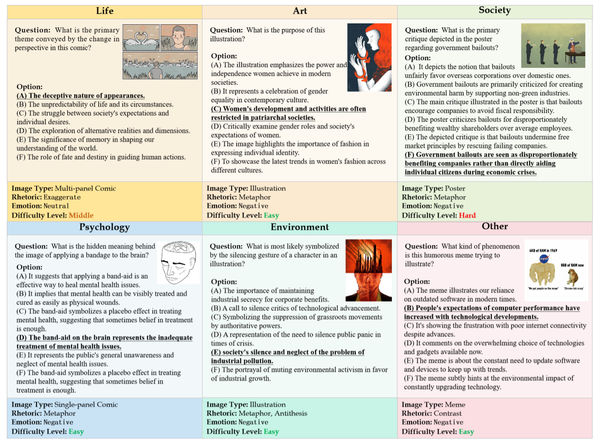
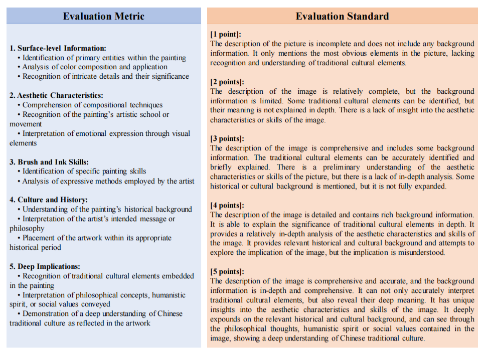

# MetaphorStar

<div align="center">

**Image Metaphor Understanding and Reasoning with End-to-End Visual Reinforcement Learning**

[](https://arxiv.org/abs/XXXX.XXXXX)
[](https://huggingface.co/collections/MING-ZCH/metaphorstar)
[](https://huggingface.co/collections/MING-ZCH/metaphorstar)
[](https://huggingface.co/collections/MING-ZCH/metaphorstar)
[](LICENSE)

[Paper](#) | [Models](https://huggingface.co/collections/MING-ZCH/metaphorstar) | [Dataset](https://huggingface.co/collections/MING-ZCH/metaphorstar) | [Benchmark](https://huggingface.co/collections/MING-ZCH/metaphorstar)

</div>

---

## 🔥News
<!-- - **[Feb. 2026]**: Our paper has released on [arXiv](https://arxiv.org/abs/2505.17019) , check it out! -->
- **[Jan. 2026]**: Our code and dataset have been released!

## ✨ Highlights

- 🎯 **First Visual RL Framework for Image Metaphors**: End-to-end reinforcement learning approach specifically designed for image implication understanding
- 📊 **Large-Scale Dataset & Benchmark**: TFQ-Data with 14k high-quality training samples (cartoons, ads, art, memes, etc.) + TFQ-Bench for rigorous evaluation across diverse metaphorical images
- 🏆 **State-of-the-Art Performance**: Outperforms GPT-4.1 and Claude-4.0-Sonnet on multiple benchmarks
- 🚀 **82.6% Improvement**: Massive accuracy gains on TFQ tasks compared to base models
- 🧠 **Enhanced General Reasoning**: Improves performance on general vision benchmarks (MMBench, MathVista, MMVet) - metaphor understanding as cognitive training
- 🔓 **Fully Open-Source**: Models (3B, 7B, 32B), training/evaluation datasets, and complete codebase all publicly available

## 📋 Table of Contents

- [Introduction](#introduction)
- [Motivation](#motivation)
- [Method](#method)
- [MetaphorStar Model Family](#metaphorstar-model-family)
- [Evaluation](#evaluation)
- [Experiments](#experiments)
- [Ablation Study](#ablation-study)
- [Citation](#citation)
- [Acknowledgments](#acknowledgments)

## Introduction

Metaphorical comprehension in images remains a critical challenge for Nowadays AI systems. While Multimodal Large Language Models (MLLMs) excel at basic Visual Question Answering (VQA), they consistently struggle to grasp the nuanced cultural, emotional, and contextual implications embedded in visual content. This difficulty stems from the task's demand for sophisticated multi-hop reasoning, cultural context, and Theory of Mind (ToM) capabilities, which current models lack. To fill this gap, we propose **MetaphorStar**, the first end-to-end visual reinforcement learning (RL) framework for image implication tasks. Our framework includes three core components: the fine-grained dataset **TFQ-Data**, the visual RL method **TFQ-GRPO**, and the well-structured benchmark **TFQ-Bench**.

Our fully open-source MetaphorStar family, trained using TFQ-GRPO on TFQ-Data, significantly improves performance by an average of 82.6% on the image implication benchmarks. Compared with 20+ mainstream MLLMs, MetaphorStar-32B achieves state-of-the-art (SOTA) results on True-False Question and Open-Style Question, and significantly outperforms top closed-source models GPT-4.1 and Claude-4.0-Sonnet on Multiple-Choice Question. Crucially, our experiments reveal that learning image implication tasks improves the general understanding ability, especially the complex visual reasoning ability. We further provide a systematic analysis of model parameter scaling, training data scaling, and the impact of different model architectures and training strategies, demonstrating the broad applicability of our method.

## Motivation

Understanding visual metaphors represents the pinnacle of visual intelligence. While current MLLMs excel at describing *what* appears in an image, they fundamentally fail to comprehend *why* elements are present or *what deeper meanings they convey*.

### The Core Challenges

**1. The Multi-Hop Reasoning Gap**

Image metaphor understanding demands complex cognitive chains:
```
Visual Elements → Symbolic Recognition → Metaphorical Mapping → Cultural Context → Emotional Resonance → Deep Implication
```
Standard Supervised Fine-Tuning (SFT) proves insufficient for teaching this intricate reasoning process, as it primarily optimizes for output correctness rather than reasoning quality.

**2. Why Reinforcement Learning?**

To bridge this reasoning gap, we leverage Reinforcement Learning (RL). Unlike preference-based methods (e.g., RLHF for alignment), our approach optimizes the *reasoning process itself*, encouraging models to develop explicit, step-by-step thought chains.

**3. The Challenge of "Visual RL"**

In mathematical or coding domains, RL succeeds because ground truth is absolute and verifiable. However, visual metaphor interpretation is inherently subjective and open-ended. **How can we apply reasoning-based RL to the ambiguous, culturally-dependent domain of visual interpretation?**

**4. Our Solution: True-False Question (TFQ) Paradigm**

We resolve this fundamental tension by formalizing image implication as a **True-False Question (TFQ)** task. This paradigm provides:

- **Binary Verifiability**: Converting subjective interpretations into verifiable binary judgments (True/False)
- **Deterministic Rewards**: Enabling clear reward signals for RL optimization ($r=1$ for correct, $r=0$ for incorrect)
- **Forced Reasoning**: Requiring models to generate explicit Chain-of-Thought (CoT) reasoning within `<think>...</think>` tags before providing answers

This formulation bridges the gap between open-ended generation and rigorous RL training, enabling systematic improvement of visual reasoning capabilities.


## Method

Our framework, **MetaphorStar**, leverages the **TFQ (True-False Question)** paradigm to systematically inject reasoning capabilities into MLLMs through reinforcement learning.

### Why TFQ?

Previous benchmarks have advanced image implication evaluation through diverse formats. II-Bench introduced **Multiple-Choice Question (MCQ)** for balanced assessment, while CII-Bench proposed **Open-Style Question (OSQ)**, representing the upper bound of task difficulty due to its high openness and sophisticated reasoning demands.

Our analysis reveals a clear spectrum of challenges. While MCQ provides stable, medium-difficulty evaluation and OSQ tests the limits of generative reasoning, there exists a gap for more foundational assessment. We introduce **True-False Question (TFQ)** as a fine-grained complement to MCQ, establishing the lower bound of difficulty. Unlike formats targeting a single inferential conclusion, TFQ probes understanding across multiple dimensions by presenting a series of statements about an image—covering not only the central implication but also essential visual information (akin to basic VQA), ensuring holistic evaluation from perception to cognition.

As summarized below, the three formats offer complementary evaluation capabilities. We analyze them across three key dimensions essential for Reinforcement Learning:

| Dimension | TFQ | MCQ | OSQ |
|:----------|:---:|:---:|:---:|
| **Knowledge Density** | ⭐⭐⭐ | ⭐⭐ | ⭐ |
| **Learnability** | ⭐⭐⭐ | ⭐⭐ | ⭐ |
| **Verifiability** | ⭐⭐⭐ | ⭐⭐ | ⭐ |

**1. Knowledge Density** (⭐⭐⭐ Highest)
- TFQ evaluates multiple distinct propositions per image (5-10 questions/image)
- Forces models to verify comprehensive factual and inferential points
- Provides **3-5× denser supervision** compared to single-answer MCQ/OSQ

**2. Learnability** (⭐⭐⭐ Highest)
- **Clear gradient signal**: Binary outcomes eliminate noisy reward estimation
- **Lower sample complexity**: Each image yields multiple training signals
- **Reduced search space**: Avoids the complex open-ended generation space of OSQ
- Enables efficient policy optimization even with limited data

**3. Verifiability** (⭐⭐⭐ Highest)
- **Definitive binary ground truth** (True/False) eliminates subjective ambiguity
- **Objective evaluation**: No reliance on model-based judges or human raters
- **Deterministic rewards**: $r=1$ for correct, $r=0$ for incorrect—critical for RL stability

**Why TFQ is Ideal for Visual RL:**

The combination of these three properties makes TFQ the optimal substrate for reinforcement learning:

- **Dense Reward Signal**: Multiple verifiable judgments per image accelerate learning
- **Forced Reasoning**: Judging complex statements requires explicit CoT (enforced via `<think>...</think>` tags)
- **Scalable Training**: Binary format enables automated large-scale data generation
- **Stable Optimization**: Objective rewards prevent the reward hacking common in open-ended generation RL

This formulation bridges the gap between open-ended generation and rigorous RL training, enabling systematic improvement of visual reasoning capabilities.

### TFQ-Data & TFQ-Bench

We construct a large-scale, high-quality dataset and benchmark to operationalize the TFQ paradigm:

#### Data Generation

To construct our dataset, we leverage 1,434 high-quality metaphorical images from the [II-Bench](https://github.com/II-Bench/II-Bench). Using GPT-4.1, we generate comprehensive True-False Questions with the following process:

**Generation Pipeline:**
- **Input**: For each image, provide detailed textual description + ground-truth implication
- **Output**: 5-10 QA pairs per image with definitive True/False answers
- **Total Scale**: 14,099 questions across 1,434 images

**Design Principles:**

1. **Comprehensive Coverage**: Each TFQ is a proposition evaluating understanding of key image content related to the central metaphor

2. **Beyond Implication**: Questions probe not only the deep implication but also primary visual information (similar to basic VQA tasks)

3. **Hierarchical Difficulty**: 
   - False statements are crafted as plausible distractors
   - True statements are clearly grounded in visual/contextual evidence
   - Difficulty levels range from surface-level to deep reasoning

#### Dataset and Benchmark Splits

We partition the total collection into dedicated training (TFQ-Data) and evaluation (TFQ-Bench) sets:


**TFQ-Data (Training Set)**

- **TFQ-Data-Full**: Large-scale training set with 1,384 images and 13,607 questions
- **TFQ-Data-Lite**: Curated subset (100 images, 984 questions) hand-picked for high quality, diversity, and richness, ideal for rapid experimentation

**TFQ-Bench (Evaluation Set)**

- **TFQ-Bench-Full**: Complete benchmark with 1,434 images and 14,099 questions  
- **TFQ-Bench-Lite**: Efficient test set with 50 representative images and 492 questions for concise evaluation
- **Critical Property**: TFQ-Bench-Lite is strictly disjoint from TFQ-Data-Full, ensuring rigorous out-of-distribution evaluation

### TFQ-GRPO: Visual Reinforcement Learning

We propose **TFQ-GRPO** (Group Relative Policy Optimization for True-False Questions), a specialized visual RL algorithm tailored for image implication understanding.

**Core Design Principles:**

**1. Structured Output Format**
- Enforce strict output structure: `<think> [reasoning] </think> <answer> [True/False] </answer>`
- Separates reasoning process from final judgment
- Enables independent evaluation of reasoning quality and answer correctness

**2. Multi-Component Reward Function**

Our reward function combines multiple objectives:

$$R_{\text{total}} = R_{\text{accuracy}} + \lambda_{\text{format}} \cdot R_{\text{format}}$$

Where:
- **Accuracy Reward** ($R_{\text{accuracy}}$):
  - $+1$ for correct answer
  - $0$ for incorrect answer
  - Primary signal for judgment correctness

- **Format Reward** ($R_{\text{format}}$):
  - Verifies proper XML tag structure
  - Checks presence and ordering of `<think>` and `<answer>` blocks
  - Ensures non-empty reasoning content
  - Weight $\lambda_{\text{format}}$ balances format compliance with accuracy

**3. Group Relative Optimization Mechanism**

- **Sampling Strategy**: For each (image, question) pair, sample $K$ diverse outputs
- **Baseline Estimation**: Compute group average reward as baseline
  $$b = \frac{1}{K} \sum_{i=1}^{K} R_i$$

- **Relative Advantage**: Calculate advantage for each output
  $$A_i = R_i - b$$

- **Policy Update**: Optimize policy to increase probability of high-advantage outputs
  $$\mathcal{L}_{\text{GRPO}} = -\mathbb{E}_{(x,y) \sim D} \left[ \sum_{i=1}^{K} A_i \cdot \log \pi_{\theta}(y_i | x) \right]$$

## MetaphorStar Model Family

We release a series of models trained with our framework.

| Model | Base Model | Method | Size | Link |
| :--- | :--- | :--- | :--- | :--- |
| **MetaphorStar-3B** | Qwen2.5-VL-3B | TFQ-GRPO | 3B | [HuggingFace](https://huggingface.co/MING-ZCH/MetaphorStar-3B) |
| **MetaphorStar-7B** | Qwen2.5-VL-7B | TFQ-GRPO | 7B | [HuggingFace](https://huggingface.co/MING-ZCH/MetaphorStar-7B) |
| **MetaphorStar-32B** | Qwen2.5-VL-32B | TFQ-GRPO | 32B | [HuggingFace](https://huggingface.co/MING-ZCH/MetaphorStar-32B) |

*Note: For detailed training protocols, please refer to [train](train/).*

## Evaluation

We conduct comprehensive evaluation across three complementary task formats: **True-False Question (TFQ)**, **Multiple-Choice Question (MCQ)**, and **Open-Style Question (OSQ)**. Each format targets distinct reasoning abilities, from fine-grained judgment to holistic generation.

### True-False Question (TFQ)

TFQ requires models to judge whether a given statement about an image is True or False. Each image is accompanied by 5-10 statements covering both surface-level visual information and deep metaphorical implications. Models must provide explicit reasoning in `<think>...</think>` tags before giving binary answers.

**Evaluation Setup:**
- **Benchmark**: TFQ-Bench (1,434 images, 14,099 questions)
- **Metric**: Binary classification accuracy

### Multiple-Choice Question (MCQ)

MCQ presents models with the question "What is the implication in this image?" and six candidate options, where only one answer is correct. This format tests the model's ability to select the most appropriate interpretation from a constrained set of choices.

**Evaluation Setup:**
- **Benchmark**: High-level Bench (50 curated high-quality images)
- **Format**: 6-option selection per image
- **Metric**: Selection accuracy
- **Image Types**: Comics, posters, illustrations, Internet memes



### Open-Style Question (OSQ)

OSQ represents the upper bound of task difficulty, requiring models to generate free-form responses to "What is the implication in this image?" without pre-defined answer constraints. This evaluates comprehensive interpretation capabilities.

**Evaluation Setup:**
- **Benchmark**: High-level Bench (50 curated high-quality images)
- **Evaluator**: GPT-4o with our 5-dimensional metric (***Surface-level Information***, ***Emotional Expression***, ***Domain and Context***, ***Rhetorical Skills***, and ***Deep Implications***)
- **Validation**: Human consistency checks (98.7% agreement with GPT-4o scores)



*Note: For detailed evaluation protocols, please refer to [evaluation](evaluation/).*

## Experiments

### Main Experiment

**State-of-the-Art Performance:** MetaphorStar-32B achieves SOTA on all major benchmarks.
*   **TFQ:** We outperform GPT-4.1 and Claude-4.0-Sonnet, demonstrating superior discriminative visual reasoning.
*   **MCQ:** Our model surpasses open-source models (like LLaVA-OneVision) and rivals closed-source giants.
*   **OSQ:** The rich reasoning patterns learned via RL transfer directly to generation tasks, producing deeper and more culturally 
aware interpretations.


### Generalization Experiment

**Does learning metaphor help general vision? YES.**
We evaluated MetaphorStar on general benchmarks (MMBench, MathVista, MMVet). The results show that training on *implication* tasks improves valid performance on *general* complex reasoning tasks, suggesting that "Image Metaphor Understanding" serves as a high-level cognitive workout for MLLMs.


## Ablation Study

We conduct comprehensive ablation studies to validate our design choices and understand the factors contributing to MetaphorStar's success. Our analysis covers four critical dimensions: model scale, data scale, architectural choices, and training strategies.

### 1. Model Parameter Scaling
We observed consistent performance gains scaling from 3B to 32B. Larger models benefit more significantly from the RL stage, showing emergent reasoning capabilities with longer CoT paths.


### 2. Training Data Scaling
Scaling TFQ-Data from 1k to 14k samples shows a log-linear improvement in reasoning accuracy. The diversity of the dataset (covering politics, art, humor) is crucial for preventing overfitting to specific visual styles.


### 3. Different Model Architecture
We validated our framework across LLaVA architectures. TFQ-GRPO proves to be model-agnostic, consistently improving the reasoning baseline of different backbones.


### 4. Different Training Strategy

We explore the impact of different training strategies by comparing three approaches:

1. **TFQ-SFT**: Supervised Fine-Tuning only
2. **TFQ-SFT + TFQ-GRPO**: SFT warmup followed by RL
3. **TFQ-GRPO** (Ours): End-to-end RL without SFT warmup

For SFT experiments, we use TFQ-Data-Lite-SFT (984 expert reasoning trajectories from Claude-3.7-thinking).

**Key Finding: The "SFT Curse"**

Counterintuitively, **SFT warmup actively harms performance**. End-to-end RL (TFQ-GRPO) achieves strongest results on TFQ and MCQ. Both SFT-involving strategies cause catastrophic MCQ collapse (46% → 28%), indicating severe generalization damage.

**The OSQ Paradox:** SFT+RL scores highest on OSQ (3.66) despite objectively worse discriminative performance. This is an evaluation artifact—SFT models produce verbose, multi-viewpoint outputs that bias LLM judges, while our concise RL model is unfairly penalized.

**Technical Explanation: Entropy Collapse**

Token entropy analysis reveals the mechanism:
- **Base Model** (1.33): High exploration capacity
- **End-to-end RL** (1.23): Maintains broad solution space
- **SFT** (0.30): Severe entropy collapse—behavioral cloning traps model in narrow distribution
- **SFT + RL** (0.29): RL cannot escape SFT-induced local optimum

**Why SFT Fails:**

1. **Task Mismatch**: Image implication demands creative generalization; SFT's maximum likelihood penalizes low-probability (creative) reasoning paths
2. **"Talker" vs. "Thinker"**: TFQ/MCQ require discriminative logic, not just plausible generation. SFT teaches format but not reasoning
3. **Evaluation Bias**: LLM judges mistake SFT-induced verbosity for depth, penalizing RL's concise accuracy

**Key Insights:**

1. **SFT warmup is not only unnecessary but actively detrimental** for image metaphor understanding task
2. **Entropy preservation is critical**: End-to-end RL leverages high initial entropy for global optimization
3. **On-policy RL cannot escape SFT-induced local optima**: Once entropy collapses, recovery is impossible
4. **Task-specific optimization matters**: Direct reward-based training outperforms behavioral cloning for creative reasoning
   


## Citation

If you find our work helpful in your research, please cite the following paper:

```bibtex
@article{zhang2026metaphorstar,
  title={MetaphorStar: Image Metaphor Understanding and Reasoning with End-to-End Visual Reinforcement Learning}, 
  author={Chenhao Zhang, Yazhe Niu and Hongsheng Li},
  journal={arXiv preprint arXiv:xxx},
  year={2026}
}
```

## License

This project is released under the [Apache 2.0 License](LICENSE).

## Acknowledgments

We sincerely thank the following projects and teams for their valuable contributions to the research community:

* **[II-Bench](https://github.com/II-Bench/II-Bench)**: An English Image Implication Understanding Benchmark for Multimodal Large Language Models *(NeurIPS 2024)*
* **[CII-Bench](https://github.com/MING-ZCH/CII-Bench)**: Can MLLMs Understand the Deep Implication Behind Chinese Images? *(ACL 2025)*
* **[LAD](https://github.com/MING-ZCH/Let-Androids-Dream-of-Electric-Sheep)**: Let Androids Dream of Electric Sheep - A Human-Inspired Image Implication Understanding and Reasoning Framework
* **[Qwen2.5-VL](https://github.com/QwenLM/Qwen2.5-VL)**: The base model series for our MetaphorStar family

## Contact

For questions, issues, or collaboration opportunities, please:
- Open an issue on GitHub
- Contact: [MING-ZCH](https://github.com/MING-ZCH)

